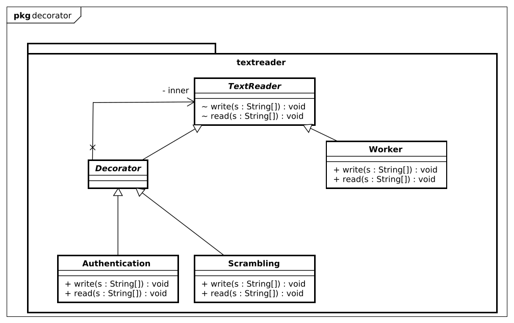

# "*Decorator - TextReader*" - Taskdescription

## Einführung
Das Beispiel für das Decorator Pattern implementieren, dokumentieren und testen.

## Ziele
Verständnis des Decorator-Patterns und Umsetzung eines UML-Klassendiagrammes in einen funktionierenden Code. Weiters soll der bestehende Code angepasst werden und die entsprechenden Änderungen und Erweiterungen dokumentiert werden.

## Voraussetzungen
* Grundverständnis von Java
* Verwendung eines UML-Tools
* Code in Deployment-Umgebung einbinden
* Grundlegende Software-Testing-Skills

## Detaillierte Aufgabenbeschreibung
Schreiben Sie ein Programm, dass Daten mittels Passwort und Verschlüsselung
gegen unerwünschten Zugriff schützt:



Der angehängte Code dient zum Ausführen und Verifizieren der Funktionalität! Die Klasse TextReader ist die Basis für die Decorator-Klasse und die Worker-Klasse.

Gewünschte Ausgabe:
```
main:		let's start!
PASSWORD:	123456
Input:		Mein total sicherer Text!
encrypt:	
main:		H`diojo\gnd^c`m`mO`so
PASSWORD:	123456
decrypt:	
Output:		Mein total sicherer Text!
```

Empfohlene Vorgehensweise:

* Eingabe eines Passwortes
* Eingabe des Textes
* Verschlüsselung des Textes
* Ausgabe des verschlüsselten Textes
* Erneute Eingabe des Passworts
* Falls das Passwort korrekt war:
	* Entschlüsselung des Textes
	* Ausgabe des entschlüsselten Textes
* Falls das Passwort nicht korrekt war:
	* Hinweis zur fehlerhaften Eingabe des Passwortes
* Beendigung des Programmes

Implementieren Sie die Klasse ``TextReader`` als Interface. Welche Veränderungen ergeben sich daraus? Gibt es dadurch Vor- bzw. Nachteile?

## Bewertung
Gruppengrösse: 1 Person
### Grundanforderungen **überwiegend erfüllt**
- [x] Code ausführbar machen
- [x] Kurze Dokumentation des Decorator-Patterns schreiben
- [x] Implementierung von ``Authentication`` und ``Scrambling`` abschließen
- [ ] gewünschte Funktionalität über ``Main`` überprüfen
### Grundanforderungen **zur Gänze erfüllt**
- [ ] ``TextReader`` als Interface umsetzen
- [ ] Änderungen entsprechend dokumentieren und dabei Vor-/Nachteile anführen
- [ ] gewünschte Funktionalität in Testcases überprüfen
- [ ] mögliche Fehlerfälle überprüfen (Grenzwerte, Eingabefehler)

## Quellen
* [Decorator Pattern - Vince Huston](http://www.vincehuston.org/dp/decorator.html)
* [Head First - Design Patterns](https://www.oreilly.com/library/view/head-first-design/0596007124/)
